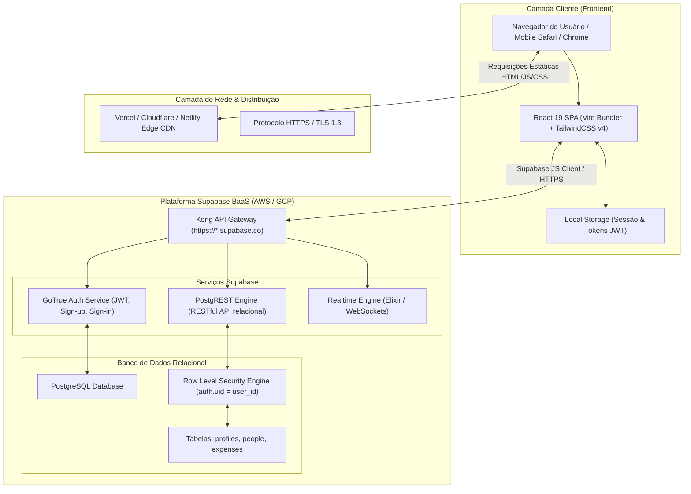
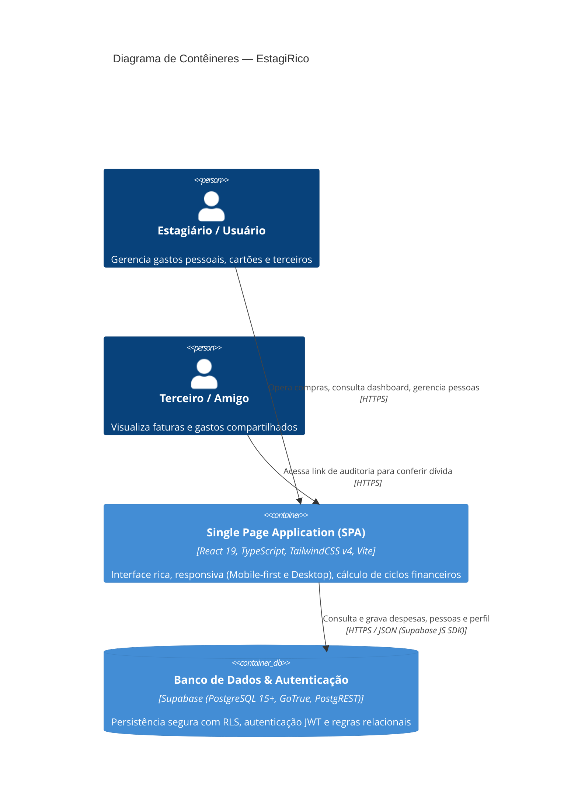
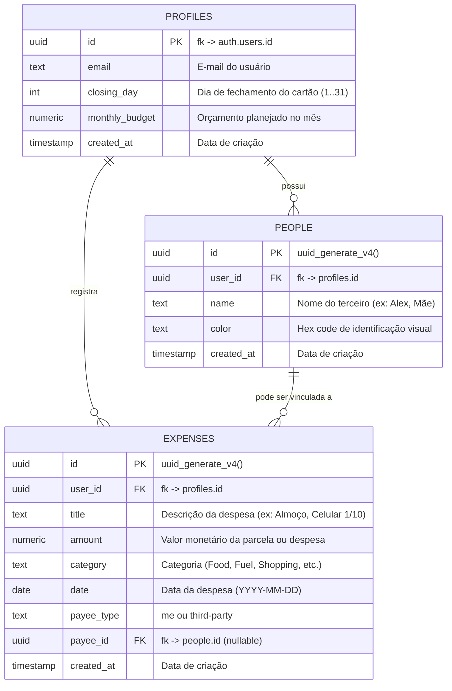
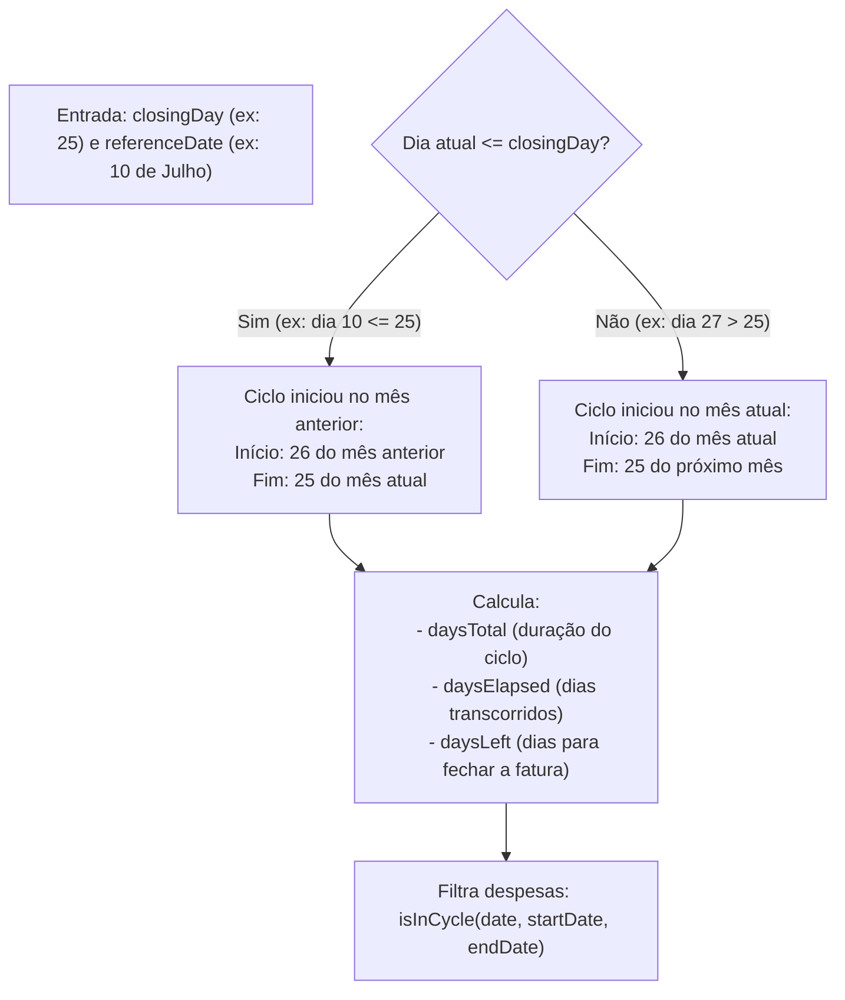
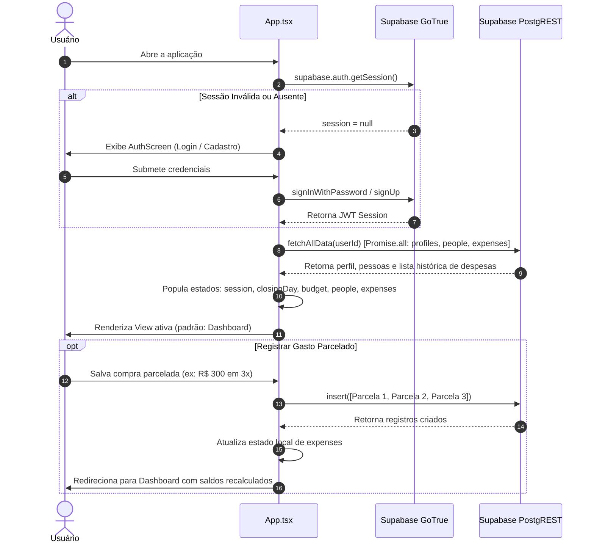

# 🏗️ Arquitetura e Topologia Completa — EstagiRico

Este documento detalha a topologia de infraestrutura, arquitetura de software, fluxo de dados, modelo relacional e mecanismos de negócio do projeto **EstagiRico**.

---

## 🗺️ 1. Topologia de Infraestrutura e Redes

A topologia do EstagiRico é estruturada como uma aplicação web moderna do tipo **Single Page Application (SPA)** desacoplada, apoiada pela plataforma **Backend-as-a-Service (BaaS) Supabase (PostgreSQL Cloud)**.

### 1.1. Componentes de Infraestrutura
1. **Frontend Host (SPA estática):**
   - Distribuído via CDN estático (Vercel, Netlify ou Cloudflare Pages).
   - Renderização no navegador via React 19 Client-Side Rendering (CSR).
2. **Gateway e Proxy Reverso:**
   - Supabase Kong Gateway orquestra autenticação (`/auth/v1`), operações de dados REST (`/rest/v1`) e conexões realtime.
3. **Mecanismo de Persistência:**
   - PostgreSQL hospedado no Supabase.
   - Camada de isolamento de tenants nativa via PostgreSQL Row Level Security (RLS).

---

## 🏛️ 2. Diagrama de Arquitetura de Software (C4 Model)

### 2.1. C4 Nível 2 — Contêineres

### 2.2. C4 Nível 3 — Componentes Frontend

```mermaid
graph TD
    App["App.tsx (Orquestrador de Estado & Sessão)"]
    
    %% Telas / Views
    App --> AuthScreen["AuthScreen.tsx (Login / Cadastro)"]
    App --> LoadingScreen["LoadingScreen.tsx (Splash / Loader)"]
    App --> Dashboard["Dashboard.tsx (Resumo, Donut, Métricas)"]
    App --> AddExpense["AddExpense.tsx (Cadastro e Parcelamento)"]
    App --> TransactionsView["TransactionsView.tsx (Listagem, Filtro por Ciclo)"]
    App --> PeopleView["PeopleView.tsx (Gestão de Terceiros e Saldos)"]
    App --> SettingsView["SettingsView.tsx (Ciclo, Orçamento, Logout)"]
    
    %% Componentes Globais de Layout
    App --> Sidebar["Sidebar.tsx (Desktop Navigation)"]
    App --> BottomNav["BottomNav.tsx (Mobile Navigation)"]
    
    %% Modais e Subcomponentes
    TransactionsView --> EditExpenseModal["EditExpenseModal.tsx (Editar / Excluir)"]
    Dashboard --> DonutCenter["DonutCenter.tsx (Gráfico Recharts)"]
    TransactionsView --> DonutCenter
    PeopleView --> Avatar["Avatar.tsx"]
    Dashboard --> Avatar
    TransactionsView --> Avatar
    SettingsView --> Dropdown["Dropdown.tsx"]
    
    %% Módulos de Suporte
    App --> LibSupabase["lib/supabase.ts (Cliente Supabase)"]
    Dashboard --> LibUtils["lib/utils.ts (Cálculo de Ciclos & Moeda)"]
    TransactionsView --> LibUtils
    PeopleView --> LibUtils
    SettingsView --> LibUtils
    AddExpense --> LibUtils
    App --> LibTypes["lib/types.ts (Interfaces & Tipos TS)"]
    App --> LibConstants["lib/constants.ts (Categorias, Cores, Menus)"]
```

---

## 💾 3. Modelo de Dados Relacional (PostgreSQL)

O banco de dados relacional é estruturado em torno do isolamento por usuário (`user_id`).

### 3.1. Dicionário de Dados
- **`profiles`**:
  - Armazena as preferências financeiras do titular.
  - `closing_day`: Dia do corte da fatura (base de cálculo para todas as telas).
  - `monthly_budget`: Meta máxima de gastos próprios mensais.
- **`people`**:
  - Cadastro de pessoas terceiras que compartilham compras no cartão do usuário.
  - Cada pessoa possui `color` para diferenciação gráfica nos avatares e relatórios.
- **`expenses`**:
  - Tabela transacional com cada lançamento individual.
  - Despesas com `payee_type = 'third-party'` geram obrigatoriedade lógica de `payee_id`.
  - **Atenção Técnica:** As compras parceladas atualmente são registradas como múltiplas linhas na tabela `expenses`, diferenciadas pela data e pelo sufixo textual no `title` (ex: `Notebook (1/6)`). Não existe ainda uma chave formal de agrupamento de parcelas (`installment_group_id`) no banco de dados.

---

## ⚙️ 4. Motor de Negócio: O Ciclo de Faturamento Dinâmico (Billing Cycle)

O grande diferencial do **EstagiRico** é o abandono da visualização estrita de mês civil (1º ao 30º dia) em favor do **Ciclo Dinâmico de Cartão de Crédito**.

### 4.1. Algoritmo de Corte (`getCurrentCycleDates` em `src/lib/utils.ts`)

### 4.2. Aplicação do Ciclo nos Fluxos da Aplicação
- **Dashboard (`Dashboard.tsx`):**
  - Considera estritamente as despesas do ciclo atual.
  - Divide gastos entre `mySpent` (meus gastos) e `totalOwed` (quanto terceiros me devem).
  - Consumo do orçamento (`pct = mySpent / budget * 100`) afeta apenas despesas próprias (`payeeType === 'me'`).
- **Transações (`TransactionsView.tsx`):**
  - Permite navegar dinamicamente entre o ciclo atual e até 12 ciclos passados (`selectedOffset`).
  - Apresenta resumo financeiro e gráfico de rosca categorizado do ciclo selecionado.
- **Pessoas (`PeopleView.tsx`):**
  - Lista de pessoas calcula o saldo devedor individual considerando apenas os lançamentos que caem dentro do ciclo financeiro vigente.

---

## 🔄 5. Fluxo de Estado e Ciclo de Vida da Aplicação

---

## 📦 6. Stack Tecnológica e Bibliotecas

| Categoria | Tecnologia | Versão | Papel no Projeto |
| :--- | :--- | :--- | :--- |
| **Linguagem** | TypeScript | `^6.0.3` | Tipagem estática, interfaces de domínio e segurança de tipos |
| **Frontend Framework** | React | `19.2.17` | Renderização de interface declarativa e componentização |
| **Build & Dev Tool** | Vite | `6.3.5` | Bundler ESM de alta performance e Hot Module Replacement (HMR) |
| **Estilização** | TailwindCSS | `4.1.12` | Framework utilitário CSS moderno via plugin nativo `@tailwindcss/vite` |
| **Design System** | Radix UI | v1.x / v2.x | Primitivos acessíveis de interface (Dialogs, Dropdowns, Tooltips, etc.) |
| **Ícones** | Lucide React | `0.487.0` | Ícones SVG limpos e uniformes |
| **Visualização de Dados** | Recharts | `2.15.2` | Gráficos de rosca (Donut chart) e composição de categorias |
| **Backend & DB** | Supabase JS | `^2.110.0` | Autenticação, sessão JWT e cliente HTTP PostgREST |
| **Manipulação de Datas** | date-fns & utils | `3.6.0` | Utilitários de cálculo e manipulação de datas |
