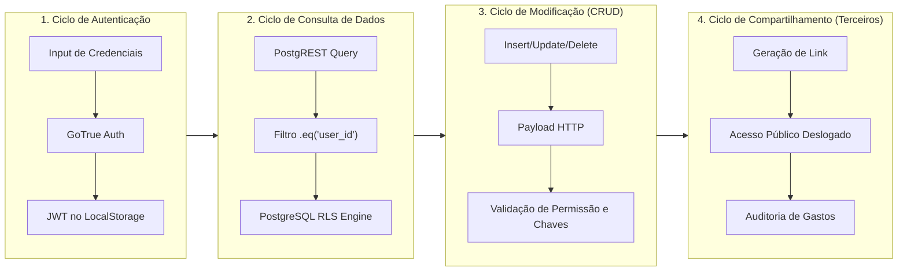
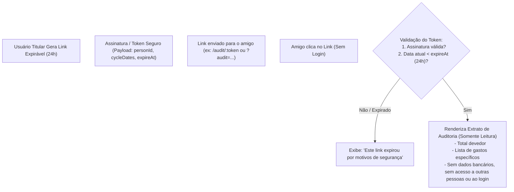

# 🛡️ Avaliação de Segurança Completa — EstagiRico

Este documento consolida a auditoria e avaliação técnica de segurança em todos os ciclos de vida, fluxos de autenticação, tráfego de dados e operações da aplicação **EstagiRico**.

---

## 🧭 1. Resumo Executivo da Postura de Segurança

A arquitetura do **EstagiRico** apoia-se no modelo **BaaS (Backend-as-a-Service)** com **Supabase**. Nesse modelo, o frontend comunica-se diretamente com o PostgreSQL através do motor **PostgREST**.
Isso significa que **a segurança da aplicação depende criticamente de políticas de autorização no próprio banco de dados (Row Level Security - RLS)**, e não apenas de verificações no código React.

| Dimensão de Segurança | Status Atual | Nível de Risco | Ação Recomendada |
| :--- | :---: | :---: | :--- |
| **Row Level Security (RLS)** | Declarativo no Client (`user_id = id`) | 🔴 **Crítico** | Aplicar regras restritivas RLS no PostgreSQL imediatamente |
| **Autenticação & JWT** | GoTrue Supabase (Bearer Token) | 🟡 **Médio** | Adicionar renovação/timeout explícito e feedback de expiração |
| **Exposição de Credenciais** | Anon Key pública em `.env` | 🟢 **Baixo** (Normal no Supabase) | Monitorar limites de quota e validar se RLS impede vazamentos |
| **Validação de Inputs** | Validação HTML5 e React básica | 🟡 **Médio** | Adicionar Zod para validação rigorosa de esquemas e sanitização |
| **Integridade Relacional** | Validação client-side manual | 🟡 **Médio** | Adicionar constraints no Postgres (`ON DELETE CASCADE` ou `SET NULL`) |
| **Links de Auditoria (Expiráveis)** | Em planejamento (Task 3) | 🟡 **Médio** | Utilizar tokens assinados criptograficamente com TTL estrito de 24h |

---

## 🔍 2. Auditoria Ciclo a Ciclo: Vulnerabilidades e Vetores de Ataque



---

### 2.1. Ciclo de Autenticação & Sessão

#### Cenário Atual
- A aplicação utiliza `supabase.auth.signInWithPassword` e `supabase.auth.signUp`.
- Os tokens de acesso e refresh tokens do Supabase são persistidos no `localStorage` do navegador.

#### Riscos Identificados
1. **Armazenamento de Tokens no `localStorage` (XSS Risk):**
   - Caso qualquer pacote de terceiros ou script malicioso seja injetado via XSS, o token JWT do usuário pode ser lido do `localStorage`.
   - *Mitigação:* Manter dependências limpas e auditadas (`npm audit`). No longo prazo, considerar cookies HTTP-only via BFF (Backend-for-Frontend) se a aplicação for migrada para SSR.
2. **Política de Senhas Fraca:**
   - Em `AuthScreen.tsx`, qualquer senha com 6 caracteres é aceita pelo cliente (`Password should be at least 6 characters`).
   - Não há exigência de caracteres especiais, números ou letras maiúsculas.
   - *Mitigação:* Aumentar comprimento mínimo para 8 ou 10 caracteres e utilizar checagem de força de senha no cadastro.
3. **Ausência de Interceptação de Sessão Expirada:**
   - Se o token JWT expirar enquanto a aplicação estiver em execução e uma requisição falhar com `401 Unauthorized`, a interface apenas dispara um alerta genérico (`dataError: "Erro ao carregar dados"`), sem direcionar o usuário para o login de forma graciosa.

---

### 2.2. Ciclo de Consulta e Isolamento de Dados (RLS)

#### Cenário Atual
Em `App.tsx`, as consultas são realizadas com o padrão:
```typescript
supabase.from("expenses").select("*").eq("user_id", userId);
supabase.from("people").select("*").eq("user_id", userId);
supabase.from("profiles").select("*").eq("id", userId);
```

#### O Perigo Crítico do RLS Ausente ou Incompleto
A cláusula `.eq("user_id", userId)` é apenas um filtro do cliente!
Se um atacante abrir as Ferramentas de Desenvolvedor (DevTools) ou usar ferramentas como Postman/Curl com a `VITE_SUPABASE_ANON_KEY`, ele pode executar:
```bash
curl 'https://hpaooyzdlgqghavcnvil.supabase.co/rest/v1/expenses?select=*' \
  -H "apikey: sb_publishable_WUgL7LpROWWtEuR-kb-Mrw_x_iTzpVN" \
  -H "Authorization: Bearer <SEU_TOKEN_OU_TOKEN_ANON>"
```
> [!CAUTION]
> Se o **Row Level Security (RLS)** não estiver habilitado ou configurado com políticas de `auth.uid() = user_id`, **um usuário poderá visualizar e extrair todas as despesas financeiras de todos os outros usuários cadastrados no banco!**

#### 🛡️ Regra de Ouro: Script SQL Mandatório de RLS para o PostgreSQL

```sql
-- 1. Habilitar RLS em todas as tabelas transacionais
ALTER TABLE profiles ENABLE ROW LEVEL SECURITY;
ALTER TABLE people ENABLE ROW LEVEL SECURITY;
ALTER TABLE expenses ENABLE ROW LEVEL SECURITY;

-- 2. Políticas para 'profiles'
CREATE POLICY "profiles_select_own" ON profiles
    FOR SELECT USING (auth.uid() = id);

CREATE POLICY "profiles_update_own" ON profiles
    FOR UPDATE USING (auth.uid() = id) WITH CHECK (auth.uid() = id);

CREATE POLICY "profiles_insert_own" ON profiles
    FOR INSERT WITH CHECK (auth.uid() = id);

-- 3. Políticas para 'people'
CREATE POLICY "people_all_own" ON people
    FOR ALL
    USING (auth.uid() = user_id)
    WITH CHECK (auth.uid() = user_id);

-- 4. Políticas para 'expenses'
CREATE POLICY "expenses_all_own" ON expenses
    FOR ALL
    USING (auth.uid() = user_id)
    WITH CHECK (auth.uid() = user_id);
```

---

### 2.3. Ciclo de Modificação (Criação, Atualização e Deleção)

#### 1. Inconsistência de Propriedade em IDs Referenciados (BOLA / IDOR)
- Na criação de uma despesa com terceiro (`payee_type === "third-party"`), a interface envia o `payee_id`.
- Se o RLS do PostgreSQL apenas validar `auth.uid() = user_id` na tabela `expenses`, um usuário malicioso poderia inserir em sua própria despesa o `payee_id` de uma pessoa criada por outro usuário.
- *Correção recomendada no PostgreSQL:*
  ```sql
  -- Garantir que payee_id pertence ao mesmo usuário
  ALTER TABLE expenses
  ADD CONSTRAINT fk_payee_same_user
  FOREIGN KEY (payee_id) REFERENCES people(id)
  ON DELETE SET NULL;
  ```

#### 2. Falta de Tratamento de Integridade ao Deletar Pessoas
- Em `App.tsx`:
  ```typescript
  const deletePerson = async (id: string) => {
    await supabase.from("people").delete().eq("id", id).eq("user_id", session.user.id);
  }
  ```
- **Problema:** Se existirem despesas no banco apontando para este `payee_id`, a deleção da pessoa:
  - Ou falhará silenciosamente com erro de violação de chave estrangeira (`foreign key constraint violation`);
  - Ou deixará despesas com `payee_id` apontando para um ID inexistente (gerando tela branca ou erro ao fazer `people.find(p => p.id === id)`).
- *Correção:* No frontend, antes de excluir, alertar o usuário se existirem despesas vinculadas àquela pessoa, ou configurar `ON DELETE SET NULL` no banco.

---

### 2.4. Ciclo de Validação e Sanitização de Dados (Input Integrity)

1. **Valores Monetários Negativos e Manipulação de Tipo:**
   - Em `AddExpense.tsx`, o valor é parseado no submit. Não há restrição rígida no banco (ex: `CHECK (amount >= 0)`).
   - Sem uma restrição `CHECK (amount > 0)`, um usuário ou requisição forjada poderia cadastrar valores negativos para burlar cálculos de faturas ou gerar saldos negativos irreais.
   - *Correção SQL recomendada:*
     ```sql
     ALTER TABLE expenses ADD CONSTRAINT check_amount_positive CHECK (amount >= 0);
     ```

2. **Injeção de Caracteres e Limites de Texto:**
   - Títulos de despesa e nomes de pessoas não possuem limites explícitos de caracteres no banco (`VARCHAR(255)`). Campos `text` sem limite podem sofrer abuso de armazenamento desnecessário.
   - *Correção:* Aplicar `.trim()` e truncar strings para 255 caracteres no cliente e no schema do banco.

---

### 2.5. Ciclo de Compartilhamento Externo (Task 3: Link Expirável de 24h)

A **Issue #6** introduz a funcionalidade de compartilhar uma fatura/extrato de terceiro por link com validade de 24 horas.
Este ciclo introduz uma **superfície de ataque pública (Unauthenticated Access)** que precisa de cuidados especiais de segurança:



#### Requisitos de Segurança para o Link Expirável:
1. **Princípio do Menor Privilégio (Data Minimization):**
   - O extrato compartilhado deve conter **apenas** o primeiro nome da pessoa, o valor total devido e a tabela dos gastos específicos daquela pessoa no ciclo selecionado.
   - **NUNCA** expor o e-mail do titular, o orçamento (`monthly_budget`), dados de outros terceiros ou o `user_id` em texto claro.
2. **Validade Criptográfica (TTL de 24h):**
   - O link deve conter um timestamp de expiração (`expires_at = Date.now() + 24 * 3600 * 1000`).
   - Se o link for puramente client-side, o payload deve ser codificado e validado com checagem de integridade; se for armazenado no banco, deve existir uma tabela com RLS público restrito a leitura por UUID/token de hash não-adivinhável.
3. **Imutabilidade e Somente Leitura:**
   - O link é estritamente para consulta e conferência. Nenhuma ação de escrita, exclusão ou edição pode ser executada por quem acessa o link.
4. **Proteção contra Enumeração e Bruteforce:**
   - O token gerado deve usar um UUIDv4 ou string aleatória com entropia de pelo menos 128 bits (ex: `crypto.randomUUID()`), impedindo adivinhação sequencial.

---

## 📋 3. Matriz de Ameaças (STRIDE Aplicado ao EstagiRico)

| Ameaça STRIDE | Cenário no EstagiRico | Impacto | Mitigação Implementada / Proposta |
| :--- | :--- | :---: | :--- |
| **Spoofing (Falsificação)** | Atacante forjar o token JWT de outro usuário | Alto | Supabase GoTrue valida assinaturas JWT com segredo assimétrico no servidor. |
| **Tampering (Adulteração)** | Manipular o valor de uma despesa no tráfego HTTP | Alto | Comunicação 100% via HTTPS/TLS; RLS valida permissão de UPDATE apenas do titular. |
| **Repudiation (Repúdio)** | Terceiro negar que comprou item no cartão | Médio | Link de auditoria com extrato detalhado por item, data e valor (Task 3). |
| **Information Disclosure** | Usuário deslogado consultar dados privados de despesas | Crítico | Habilitar e auditar RLS no PostgreSQL; tokens públicos com escopo restrito. |
| **Denial of Service** | Criação massiva de despesas parceladas (ex: 99x) sobrecarregando o banco | Médio | Limitar número máximo de parcelas (ex: max 48) e adicionar rate limiting no Supabase Gateway. |
| **Elevation of Privilege** | Usuário comum alterar perfil de outro usuário | Crítico | Política RLS `USING (auth.uid() = id)` na tabela `profiles`. |

---

## 🎯 4. Recomendações e Checklist de Segurança

- [x] **Comunicação Segura:** Todas as chamadas para o Supabase utilizam HTTPS e TLS 1.3 nativo.
- [ ] **Auditoria de RLS no PostgreSQL:** Executar o script SQL de Row Level Security no console Supabase para garantir que nenhuma consulta sem token JWT válido acesse dados alheios.
- [ ] **Limitação de Parcelamento:** Adicionar validação de limite máximo de parcelas (ex: 48 parcelas) em `AddExpense.tsx`.
- [ ] **Constraints no PostgreSQL:** Adicionar `CHECK (amount >= 0)` e chaves estrangeiras com `ON DELETE SET NULL` para a integridade de `payee_id`.
- [ ] **Token Expirável de 24h Seguro:** Garantir que o link da Issue #6 não vaze informações confidenciais do titular e invalide após 24 horas.
