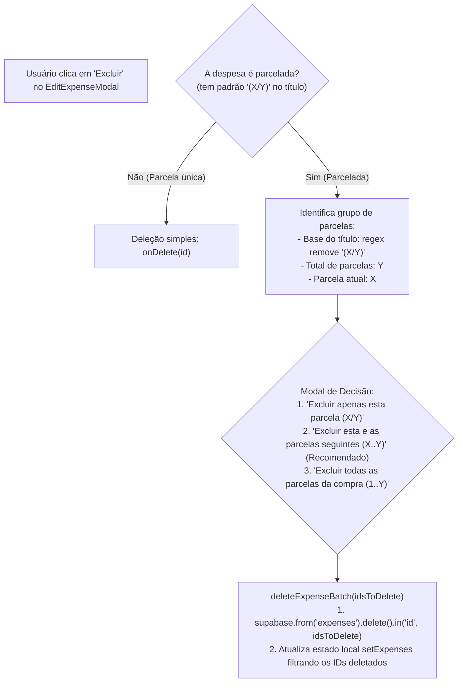
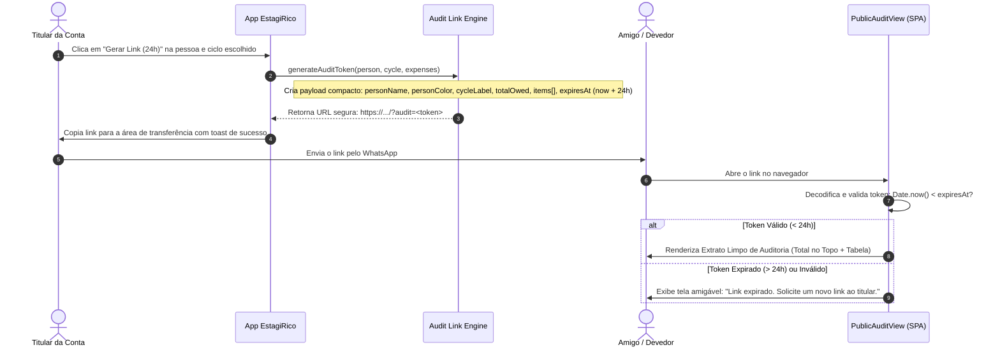

# 🛠️ Contexto de Desenvolvimento Operacional — Tasks 2 e 3

Este documento foi criado especificamente para servir como guia de referência técnica rápida e mapa de implementação para as próximas duas tasks de alta prioridade do projeto **EstagiRico**:
1. **Task 2 (Issue #5):** Bugfix na deleção de compras parceladas (apagar parcelas dos meses seguintes).
2. **Task 3 (Issue #6):** Nova Feature de Link Expirável (24h) para auditoria de gastos de terceiros.

---

## 🎯 Task 2: Bugfix na Deleção de Parceladas (Issue #5)

### 1.1. Contexto do Bug
- Quando o usuário cadastra uma compra parcelada (ex: `Notebook` em 5x), o `AddExpense.tsx` divide o valor e cria 5 registros no array de despesas com datas avançadas mensalmente (`addMonthsToDate`).
- No banco de dados Supabase (`expenses`), os títulos ficam salvos no formato:
  - `Notebook (1/5)` — Ciclo 1 (Mês atual)
  - `Notebook (2/5)` — Ciclo 2 (Mês seguinte)
  - `Notebook (3/5)` — Ciclo 3 (+2 meses)
  - `Notebook (4/5)` — Ciclo 4 (+3 meses)
  - `Notebook (5/5)` — Ciclo 5 (+4 meses)
- Como a tabela `expenses` **não possui** a coluna `installment_group_id` no Supabase, a única amarração existente é:
  1. O padrão textual no `title`: `/<nome_base> \((\d+)\/(\d+)\)$/`
  2. O valor unitário idêntico (`amount`)
  3. A mesma categoria (`category`)
  4. O mesmo beneficiário (`payee_type` e `payee_id`)
  5. A data com intervalo mensal a partir da primeira parcela
- **O Bug Atual:** Ao abrir o `EditExpenseModal.tsx` em um determinado ciclo e clicar em "Excluir", o sistema executa `onDelete(expense.id)`. Isso remove **apenas o registro do ciclo atual** (`Notebook (1/5)`), deixando as parcelas dos ciclos futuros (`2/5` a `5/5`) ativas e cobrando o usuário nos meses seguintes!

### 1.2. Como Implementar a Correção na Branch `fix/issue-5-...`

### 1.3. Arquivos Envolvidos
- `src/app/App.tsx`:
  - Adicionar suporte a deletar múltiplos IDs: `deleteExpenseBatch(ids: string[])` ou evoluir `deleteExpense(idOrIds: string | string[])`.
- `src/app/components/EditExpenseModal.tsx`:
  - Detectar se a despesa sendo editada é parcelada (`isInstallment`).
  - Se for parcelada, ao clicar em "Excluir", oferecer a confirmação clara:
    - **Opção A:** Excluir esta e todas as parcelas dos meses seguintes.
    - **Opção B:** Excluir todas as parcelas da compra.
    - **Opção C:** Excluir apenas esta parcela específica.
- `src/lib/utils.ts`:
  - Função utilitária helper (ex: `findRelatedInstallments(targetExpense, allExpenses)`) para filtrar com segurança todas as despesas que pertencem ao mesmo lote de parcelas.

---

## 🚀 Task 3: Feature Link Expirável 24h para Terceiros (Issue #6)

### 2.1. O que a Feature Deve Fazer
- O usuário titular quer auditar/cobrar uma pessoa específica em um determinado ciclo.
- Na interface (em `PeopleView` ou `TransactionsView`), o titular escolhe:
  1. A **Pessoa Terceira** (ex: "Alex");
  2. O **Ciclo Financeiro** desejado (ex: ciclo atual ou qualquer ciclo passado/futuro).
- Ao clicar em "Gerar Link de Auditoria" / "Compartilhar Fatura":
  1. O sistema gera um link único copiável (com validade de 24 horas);
  2. O titular envia o link via WhatsApp / Telegram / E-mail para o terceiro;
  3. Ao abrir o link (sem necessidade de cadastro ou login), o terceiro visualiza:
     - **Header elegante no padrão visual do EstagiRico** (#6B5FD8, DM Sans, DM Mono);
     - **Identificação:** "Extrato de Despesas de [Nome da Pessoa]";
     - **Card de Destaque no Topo:** Valor total que a pessoa gastou e está devendo naquele ciclo;
     - **Identificação do Ciclo:** Período de faturamento (ex: 26 de Julho a 25 de Agosto);
     - **Tabela de Auditoria Detalhada:**
       - Data da compra;
       - Título / Descrição da compra;
       - Categoria (com ícone e badge);
       - Se foi parcelado (ex: Parcela 2 de 6);
       - Valor monetário (R$).
     - **Aviso de Expiração:** "Este link é válido por 24 horas para fins de auditoria".

### 2.2. Arquitetura Técnica do Link Expirável

### 2.3. Vantagens da Abordagem por Token Assinado/Codificado
1. **Zero dependência de novas tabelas ou migrações SQL:** Funciona imediatamente no client-side sem depender de permissões de DDL no Supabase.
2. **Segurança por Isolamento Estrito:** O terceiro **não** recebe credenciais do Supabase nem consegue consultar outras tabelas ou despesas do titular. Ele recebe estritamente a projeção de dados daquele extrato.
3. **Validade temporal estrita:** O timestamp embutido garante que após 24 horas a visualização seja bloqueada automaticamente.

### 2.4. Arquivos Envolvidos na Task 3
- `src/lib/types.ts`: Tipo para o payload de auditoria (`AuditStatementPayload`).
- `src/lib/auditToken.ts`: Funções para codificação (`generateAuditToken`) e decodificação/validação (`verifyAuditToken`).
- `src/app/components/PublicAuditView.tsx`: Tela pública moderna e responsiva com o padrão visual do EstagiRico, exibindo o totalizador no topo e a tabela detalhada abaixo.
- `src/app/components/ShareAuditModal.tsx` ou botão integrado em `PeopleView.tsx` / `TransactionsView.tsx`: Interface para disparar a geração do link e selecionar o ciclo desejado.
- `src/app/App.tsx`: Detecção de rota/parâmetro de URL (ex: `?audit=...` ou `#/audit/...`) para renderizar a visão pública sem exigir login.

---

## 📌 Resumo de Próximos Passos
- [x] **Task 1 Concluída:** Branch `docs/project-topology-and-security` com scan completo, topologia, segurança e inconsistências documentadas.
- [ ] **Task 2:** Criar branch `fix/issue-5-delete-installments` e resolver a exclusão em lote das parcelas futuras.
- [ ] **Task 3:** Criar branch `feat/issue-6-shareable-statement-link` e implementar o gerador e visualizador de link expirável de 24h.
