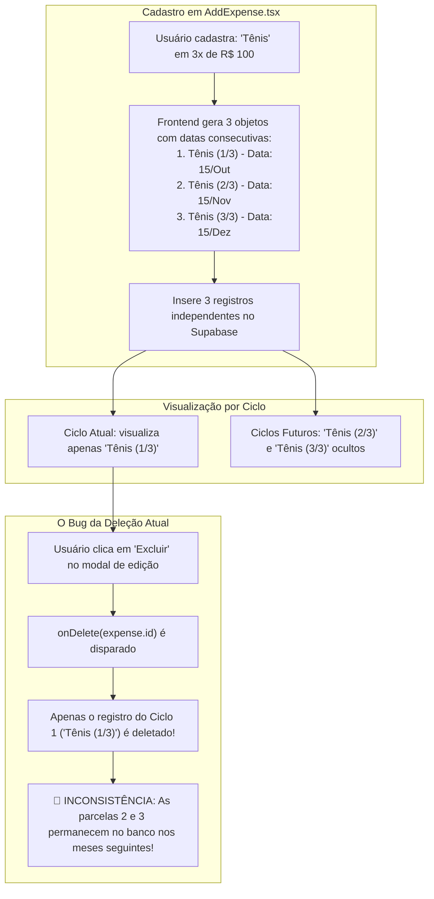

# ⚠️ Pontos Fracos, Inconsistências Técnicas e Dívidas de Código — EstagiRico

Este documento cataloga de forma detalhada os pontos fracos, inconsistências arquiteturais, trechos de código morto e bugs latentes identificados durante o scan completo do projeto **EstagiRico**.

---

## 💥 1. A Inconsistência Central das Compras Parceladas (Issue #5)

### 1.1. Diagnóstico do Problema
O ponto mais crítico de inconsistência identificado na aplicação reside na forma como **compras parceladas** são modeladas e manipuladas:



### 1.2. Raiz Técnica da Inconsistência
1. **Schema sem chave de relacionamento de grupo:**
   - A interface TypeScript `Expense` em `src/lib/types.ts` possui o campo opcional `installmentGroupId?: string;`.
   - Contudo, **a tabela `expenses` no PostgreSQL do Supabase não possui a coluna `installment_group_id`**.
   - Por conta disso, o `AddExpense.tsx` salva apenas o sufixo no título: `${finalTitle} (${i + 1}/${installments})`.
2. **Deleção cega por ID único:**
   - A função `deleteExpense` em `App.tsx` executa:
     ```typescript
     await supabase.from("expenses").delete().eq("id", expenseId).eq("user_id", session.user.id);
     ```
   - Ela desconhece totalmente se a despesa faz parte de uma sequência de parcelas ou se possui registros correspondentes nos meses seguintes.
3. **Impacto para o usuário:**
   - O usuário acredita que cancelou ou excluiu a compra, mas nos meses seguintes a dívida continua sendo contabilizada na fatura e diminuindo o orçamento!

---

## 🧩 2. Código Morto e Variáveis Hardcoded

Durante a varredura estática do código, foram encontrados trechos com dados estáticos não utilizados ou sobras de testes:

### 2.1. `selectedMonth = "2026-08"` em `src/app/App.tsx`
No arquivo `src/app/App.tsx` (linhas 243-248):
```typescript
// ── Filtros ──
const selectedMonth = "2026-08";
const montlhyExpenses = useMemo(() => {
  return expenses.filter((expense) => {
    return expense.date.startsWith(selectedMonth);
  });
}, [expenses, selectedMonth]);
```
- **Problema:** A constante `selectedMonth = "2026-08"` e o valor memoizado `montlhyExpenses` (com erro de digitação inclusive) estão declarados no corpo do componente principal mas **nunca são lidos ou passados para nenhum componente filho**.
- **Impacto:** Código morto poluindo o componente e gerando processamento inútil a cada renderização.

### 2.2. Importações e Dependências Fantasma (`package.json`)
No `package.json`, estão presentes dependências completas do **Material UI**:
- `@mui/material: 7.3.5`
- `@mui/icons-material: 7.3.5`
- `@emotion/react: 11.14.0`
- `@emotion/styled: 11.14.1`

- **Problema:** A aplicação utiliza exclusivamente **TailwindCSS v4**, **Radix UI** e **Lucide React**. O Material UI não é importado em nenhuma tela de produção.
- **Impacto:** O bundle de produção (`npm run build`) carrega dependências desnecessárias e consome tempo de instalação e compilação.

---

## 🏛️ 3. Monolito de Estado em `App.tsx`

O arquivo `src/app/App.tsx` concentra atualmente 467 linhas e atua como um "God Component" com excesso de responsabilidades:

1. **Acúmulo de Responsabilidades:**
   - Gerencia a sessão de autenticação (`session`, `authLoading`).
   - Gerencia dados centrais (`expenses`, `people`, `closingDay`, `budget`).
   - Gerencia estados transitórios de UI (`view`, `dataLoading`, `dataError`, `savingExpense`, `addingPerson`, `updatingProfile`).
   - Implementa todos os métodos de persistência direta com o Supabase (`addExpense`, `deleteExpense`, `updateExpense`, `addPerson`, `deletePerson`, `updateClosingDay`, `updateBudget`, `handleLogout`).
2. **Impacto:**
   - Dificuldade para criar testes automatizados.
   - Qualquer atualização de estado simples (ex: alternar aba) pode disparar ciclos de re-renderização desnecessários no componente raiz.
   - **Solução Futura:** Extrair a camada de dados para hooks especializados (`useExpenses`, `usePeople`, `useProfile`) ou Context API/Zustand.

---

## 🔗 4. Inconsistência na Exclusão de Pessoas (`PeopleView.tsx`)

Na exclusão de pessoas (`deletePerson`):
- O código remove o registro da tabela `people` sem tratar as despesas existentes que possuem o `payee_id` daquela pessoa.
- **Cenários de Falha:**
  1. Se houver restrição FK estrita no Postgres sem `CASCADE` ou `SET NULL`, o banco rejeita a exclusão e o usuário recebe um alerta genérico (`alert("Erro ao remover pessoa. Tente novamente.")`).
  2. Se a pessoa for excluída e o banco mantiver `payee_id`, a tela de Transações ou Dashboard ao tentar mapear `people.find(p => p.id === exp.payeeId)` receberá `undefined`, podendo gerar erros de renderização ou avatares em branco.

---

## 📱 5. Limitações de UX e Tratamento de Erros

1. **Uso de `alert()` e `window.confirm()` Nativos:**
   - A aplicação usa diálogos nativos do navegador (`window.confirm("Tem certeza...")` e `alert(...)`).
   - Além de quebrar a identidade visual polida do EstagiRico, em dispositivos móveis (PWA/Safari/Chrome) caixas de diálogo nativas causam travamento de thread e pior experiência de uso.
   - O projeto já possui a biblioteca `sonner: 2.0.3` instalada no `package.json` para toasts elegantes, mas ela não está sendo aproveitada.
2. **Tipagem Flexível com `err: any`:**
   - Praticamente todos os blocos `catch (err: any)` silenciam o tipo do erro, impedindo o tratamento inteligente de códigos de erro HTTP ou PostgreSQL (`PGRST116`, `23503`, etc.).

---

## 📅 6. Risco em Casos de Borda do Ciclo Financeiro (`utils.ts`)

A função `getCurrentCycleDates` em `src/lib/utils.ts` é o coração da regra de negócio. Existem casos de borda que exigem atenção:
1. **Meses com menos de 31 dias:**
   - Se o usuário define `closingDay = 31`, meses como Fevereiro (28/29 dias), Abril (30 dias) ou Junho (30 dias) sofrem correção automática do construtor `new Date(year, month, 31)`. No JavaScript, `new Date(2026, 1, 31)` avança automaticamente para Março!
   - Isso pode deslocar as datas do ciclo de forma sutil se não houver um `Math.min(closingDay, diasNoMes)`.
2. **Ausência de Suíte de Testes Unitários:**
   - Atualmente não há testes automatizados (Vitest/Jest) cobrindo as funções `getCurrentCycleDates`, `isInCycle` e `addMonthsToDate`. Qualquer ajuste pode gerar regressão silenciosa nas somatórias do Dashboard.
